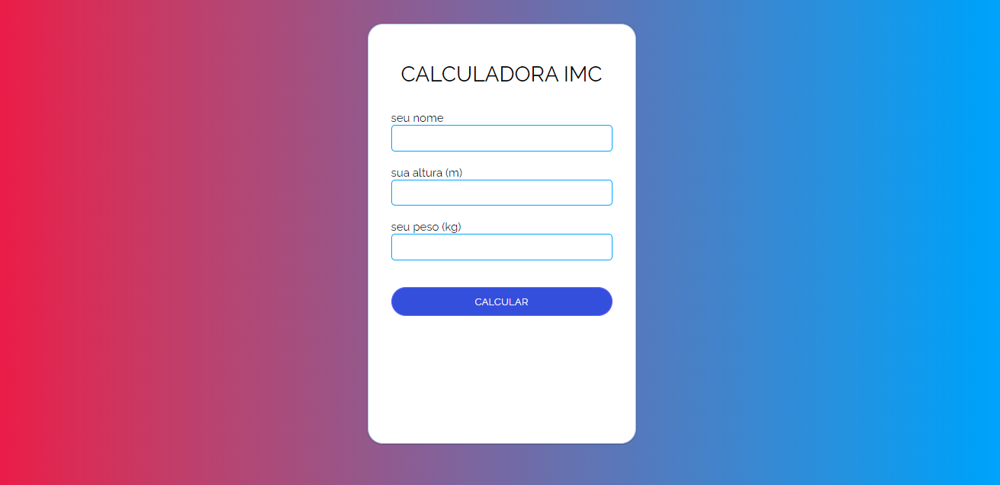

# caIMC
the calM is a simple software that is able to check if you are over, under or at your ideal weight!

 

## WHY DOES THIS PROJECT EXIST?
Because it's something relatively simple, it's just a small project that serves as training for HTML, CSS and JavaScript.

## CONTACT

 
If you liked the project or have any constructive criticism related to the repository or want to get in touch for some other reason, here are some options:

- 🌎 Share this repository with your friends!
- ⭐ If you liked the idea, you can give it a fork or a star.
- 📬 Email the development if you need something: peixinhoyago@gmail.com

 

